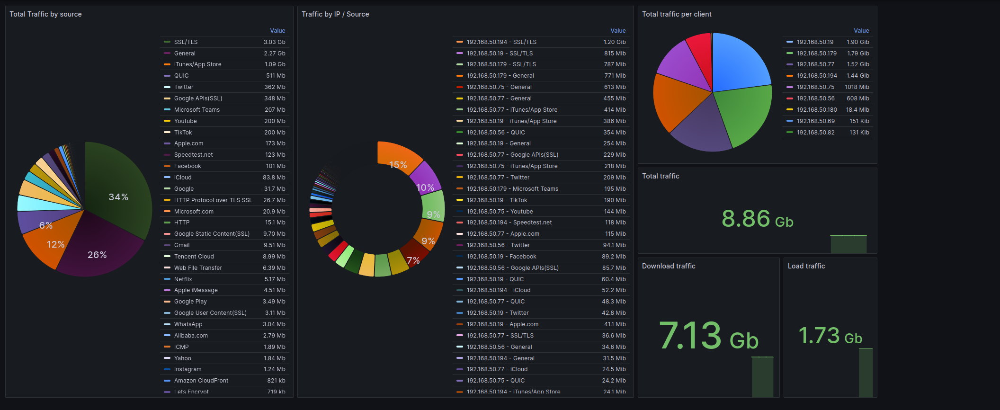

# Asus exporter - PoC

This is a simple prometheus exporter that generates metrics from your router to be scraped by prometheus. 

## How to use

Fill the required env variables:

- `ROUTER_URL`: www.asusrouter.com by default
- `ROUTER_PORT`: 8443 by default
- `ROUTER_USER`: admin by default
- `ROUTER_PASSWORD`: admin by default

Then just execute like: python3 asus_prom_exporter.py

And it will start gathering your metrics.

Note: Because right now there's only  one admin user for the router, and there's no multi-session, you cannot use this exporter AND the web interface at the same time, as everytime the exporter scrapes the metrics, it will log in and log you out. 

## Docker

There's a docker compose file that has grafana and prometheus. Grafana will require you to configure the datasource & import the dashboard (dashboard.json file). You might need to tweak the dashboard so it matches your datasource.

## Metrics exported

- general_load_traffic
- general_download_traffic
- client_load_traffic
- client_download_traffic

All data is in bits, on `general_` metrics we gather only the "source" label but on `client_` we manage client, client IP, vendor and name. 

## Example from dashboard

